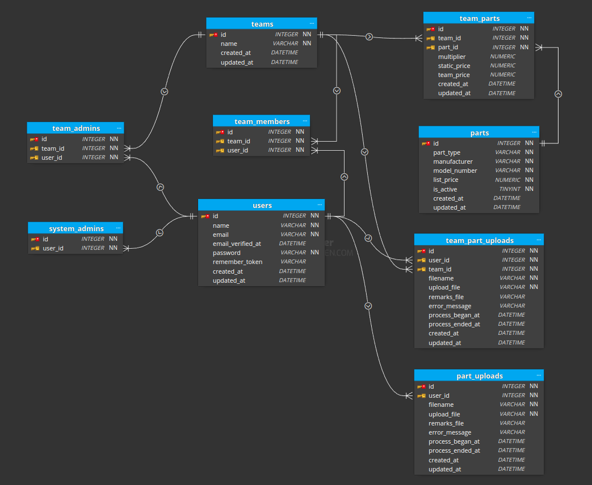

A Laravel + Inertia Vue powered project. After cloning, setup with:
 - `composer install`
 - `npm install`
 - `cp .env.example .env`
 - `php artisan key:generate`
 - `php artisan migrate --seed`
 - `php artisan serve`
 - `npm run dev`

Seed user accounts:
  - (System Admin) system_admin@example.com | password
  - (Team Admin) team_admin1@example.com | password
  - (Team Member) team_member1@example.com | password

**ERD**

**Implemented features**
- System admins can view teams
- System admins may upload/download system-wide parts
- Team admins can view system-wide parts
- Team admins can associate parts to their team
- Team admins can upload/download team pricing details
- Team members can view and search team parts and part information

**Additional features**
- Limited file size for uploads (1mb), for faster upload feedback and avoid memory hoarding processes/jobs
- Session's team is changable for members/team admins with multiple teams
- Validation results for system-wide part uploads
- Validation results for team pricing uploads

**Necessary improvements**
- Server-side pagination for datatables
  - Basic features are functional but the app will be really slow for larger dataset
- Batch team part association in a job

**Plans for improvements**
- Implement server-side pagination and filtering for all datatables
- Usage of [Laravel JSON:API](https://laraveljsonapi.io/) library that adheres to [json:api](https://jsonapi.org/) specifications: this should speed up the process of API creation and bring focus to configuration and designing the custom filters
- Usage of [pinia-jsonapi](https://github.com/mrichar1/pinia-jsonapi) on client-side to consume the standardized API endpoints
